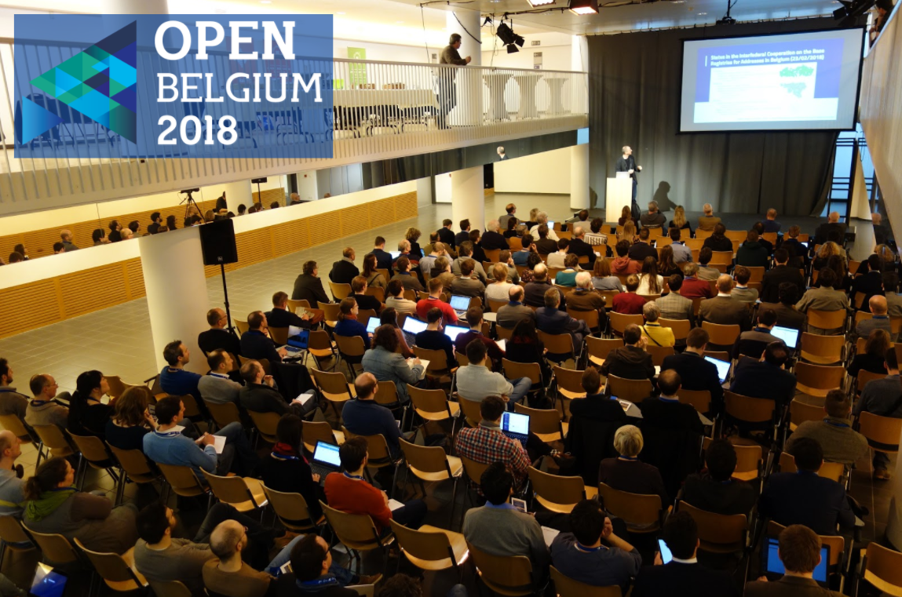
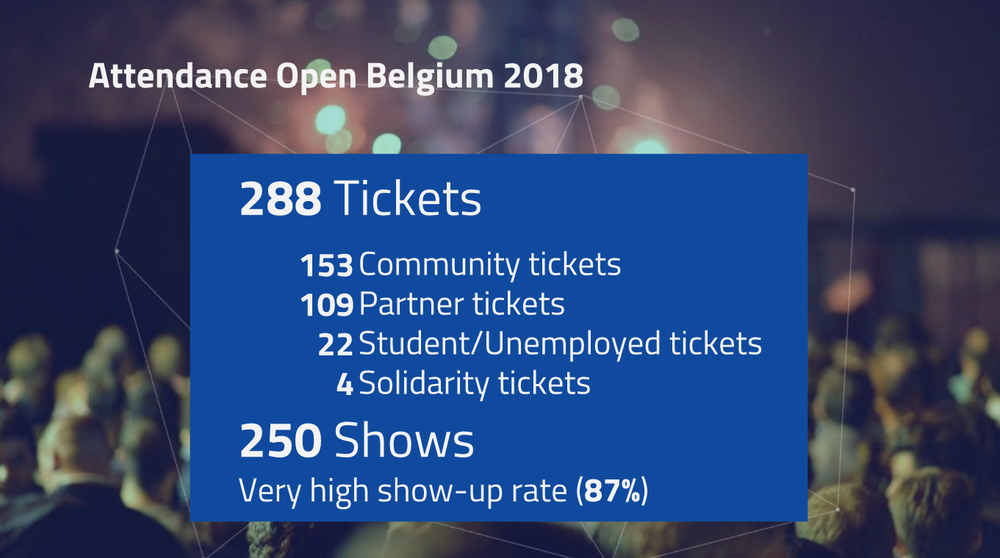
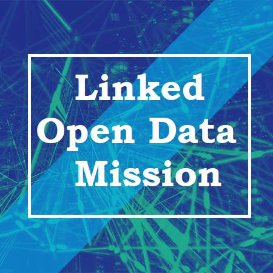
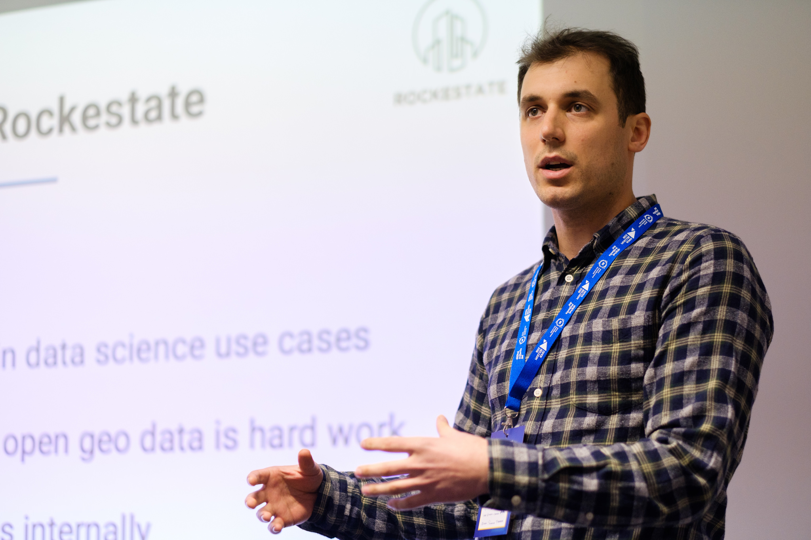
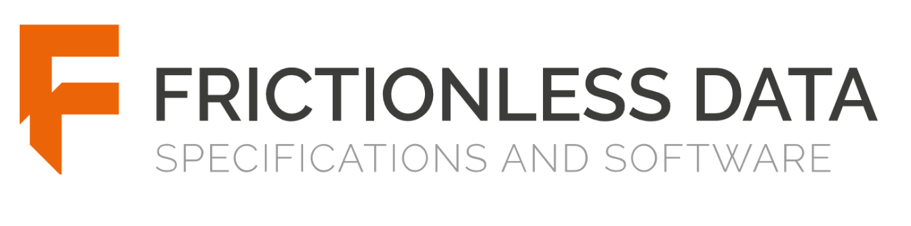
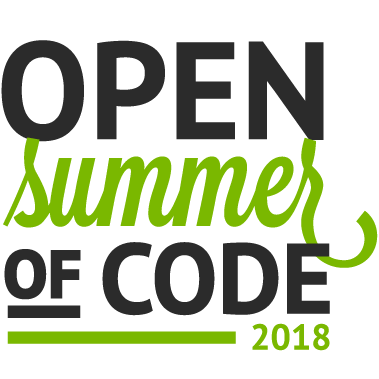
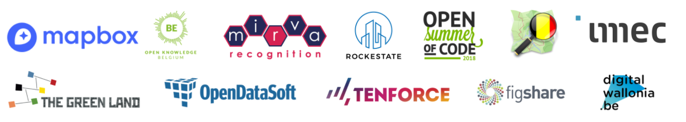

On March 12th, the World Wide Web’s 29th birthday, **250 Open Knowledge and Open Data enthusiasts** gathered in Louvain-la-Neuve, ready to **enable access for everyone to a web worth having.**  
The whole day was designed to get an update on local, national and global open initiatives as well as to share skills, expertise and ideas with like minded open data peers.

**What was new at Open Belgium 2018**

This year’s Open Belgium Conference hosted **51 speakers from government, industry, academia and community** that shared their knowledge in 35 Sessions. The presentations covered everything around Open Knowledge and Open Data, from the economic value to sustainability, privacy issues, technical challenges and solutions.

- Open Belgium has worked hard to make the conference affordable for everyone. Ticket prices were reduced by half from 2017. This year **Solidarity Tickets** were introduced; with purchase of this category ticket, one enables two less fortunate data enthusiasts to attend Open Belgium 2018.
- For the first time in Open Belgium history, **the whole event was live-streamed** and followed by 450 people online on that day.
- Instead of previous editions’ written transcripts of the sessions, this year you can find **videos of all sessions** on the [Open Knowledge Belgium Youtube channel](https://www.youtube.com/channel/UCXSJAzi8EW3PXBBrYJTDSOw).
- This year next to the main track in English, a side track in French for Wallonian public authorities was organized.

**Who attended Open Belgium 2018?**

While it’s difficult to choose amongst the wide variety of topics I would like to share with you

**My 5 personal highlights:**

**The web is under threat, and only we can save it!**

The event traditionally kicked off with the overview of the State of Open Knowledge in Belgium. Delivered by Toon Vanagt, the chairman of Open Knowledge Belgium and Benoit Hucq, Director General of Digital Wallonia, the speech this year was oriented around transforming Belgium via greater _Awareness, Empowerment, and Governance._  
While highlighting the advances in Belgium since last year, the presentation didn’t forget to shed light on the controversy around the new GDPR regulations, and caution against taking it as an excuse for locking up data, and keeping it accessible by only a few.  
[Find all Presentation Slides and Videos here](http://2018.openbelgium.be/presentations)

Other keynote speakers:  
Heleen Vollers –  
Watch ‘[Best Open Data Practices across Europe](https://www.youtube.com/watch?v=HRg4pOtF3EI&feature=youtu.be)‘  
Maarten Lambrechts –  
Watch ‘[12 Reasons why your data is not fully open](https://www.youtube.com/watch?v=Ntszj4YHUUw&feature=youtu.be)‘

**Linked Open Data Lessons**

Diving right into the day with a multitude of Linked Open Data talks. Eight talks presented the role of linked and interoperable data within different domains, amongst those cultural heritage resources, touristic data, film archives up to the digitalisation of public administrations. The obstacles related to interoperability are shared amongst all sectors and I would like share following lessons by [Agis Papantoniou](https://www.slideshare.net/OpenKnowledgeBE/linked-open-data-from-an-industry-perspective) to overcome them.

Making Data:

- reusable – publish raw data and not HTML or PDFs
- comprehensive and interoperable – Add metdata
- findable – use intuitive links to optimize data browsing
- accessible – store data in stable locations and encoded in URIs
- reusable use open licenses like CC 4.0
- use LOD Quality Assurance Frameworks

**How to unlock your data’s full potential**

In a session on Open Business Models, Kasper Van Lombeek, Founder of [Rockestate](https://www.rockestate.be/) shared how the start-up calculated various properties for all houses in Belgium (e.g. the building type, roof inclination, number of rooms).

They use the Open Lidar data-set and apply latest artificial intelligence techniques to **combine their open geo data\* with their customer’s data** to build predictive 3D models that can radically change business and industry. [Presentation here](https://www.slideshare.net/OpenKnowledgeBE/how-we-use-the-massive-open-lidar-dataset-for-the-benfit-of-our-clients)

_\*Open Geo Data is every publicly available piece of information with a spatial dimension._

Other speakers in the Open for Business Session:  
– Philippe Duchesne – [Open Data Annotations](https://www.slideshare.net/OpenKnowledgeBE/building-arguments-on-open-data)  
– Sebaastian Ter Bur, Hessel Van Oorschot, Jolan Soens, Winnie Poncelet, Gwen Franck – [Open For Business ](https://www.slideshare.net/OpenKnowledgeBE/open-for-business-90513028)

**Don’t publish data without reuse**

At 2:30 pm Frank Verschoor and Jochem Van de Berg from [The Green Land](https://thegreenland.eu/) successfully beat the inclining afternoon slump with their interactive session explaining how to effectively use open data in practice. At the example of their project [‘Flevoland (NL) Smarter’](https://www.slideshare.net/OpenKnowledgeBE/smarter-by-open-data-process-and-practice-in-flevoland-nl), they showed the impact of active listening and preferencing needs over assumptions on data utility.

To conclude, **Open Data are only valuable when they meet needs, so don’t publish data without reuse!**

**The Future of data is Frictionless**

Vitor Baptista, Engineering Lead at [Open Knowledge International](https://okfn.org/) hosted the “Using Frictionless Data software to turn data into insight” hackathon. OKI’s [Frictionless Data Initiative](https://frictionlessdata.io/) is about making it effortless to transport quality data among different tools and platforms for further analysis.  
Unfortunately, not all attendees had brought their own laptop, but those that did were introduced to the software that streamlines data workflow process, and learned how to add metadata and to validate datasets.

_Be part of a vibrant open source, open data community_

  

**What’s next…?**

For you who still don’t have enough of Open Knowledge and Open Data, check out the 8th edition of [Open Summer of Code 2018.](http://2018.summerofcode.be/)

The 4-week summer programme in July provides Belgian based students the training, network, and support necessary to transform open innovation projects into powerful real-world services.

**See you at Open Belgium 2019!**

Thanks for reading my personal highlights, it was really tough to choose between all the fantastic presentations! Find all [presentations here.](http://2018.openbelgium.be/presentations) Videos will follow soon, and for more Open Belgium pictures see [Wikimedia.](https://commons.wikimedia.org/wiki/Category:Open_Belgium_2018)

Lastly, a big thank you to the partners that made Open Belgium 2018 possible!

