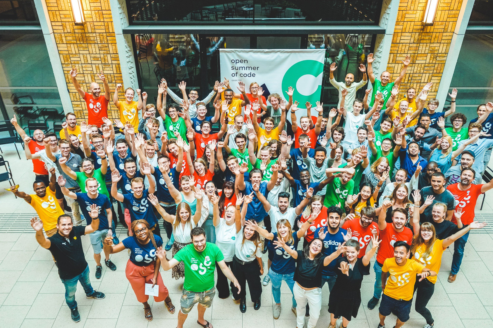
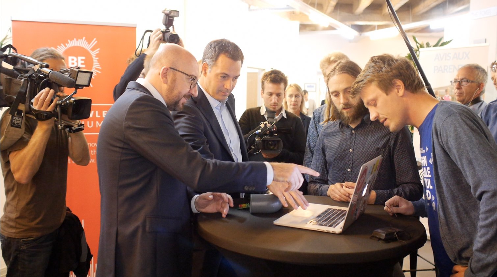
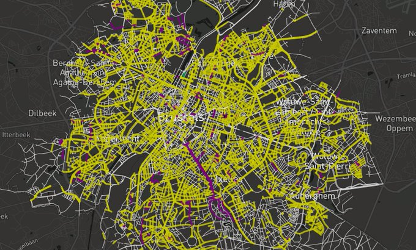
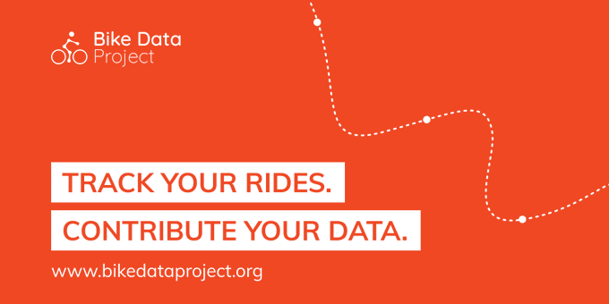
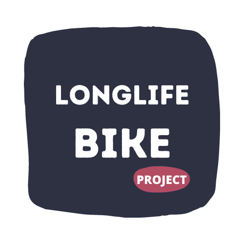

**After more than 4 fantastic years at Open Knowledge Belgium, I have decided that it is time to pass on my role as general coordinator of the organisation and I’ll make room for new projects. I would like to thank everyone very much for the way we have worked together over the years. I can only hope that our paths will cross again in the future! I’m leaving on a mission to make bicycles more local, open & circular. With my colleague Astrid Steenackers as my successor, supported by a motivated and dedicated team and board, Open Knowledge Belgium is ready for its next steps.**

## **Proud of what we’ve achieved together**

My decision to move on marks the end of a very rewarding and important chapter for me. What started out with [several aspirations back in 2016](https://openknowledge.be/2016/09/28/a-new-challenge-for-me-is-a-new-opportunity-for-open-knowledge-belgium) (when I took over from the one and only Pieter-Jan) really turned into meaningful projects and partnerships. It's been an amazing time in one of the most eclectic roles I could ever imagine, and that enabled me to learn and discover so much, and grow personally and professionally.

I feel very proud and immensely grateful to all people - with different backgrounds and skills - who have been contributing to Open Knowledge Belgium’s mission of building a world where knowledge creates power for the many, not the few. Our community has significantly grown over the years as our number of projects and impact did. To highlight 7 memorable achievements that I’m very proud of having been involved in:

* Year after year, [open summer of code](https://osoc.be/) has been growing in terms of participants, coaches and partners. Our [latest and biggest edition](https://osoc.be/editions/2020) - which was an unusual and challenging one due to the remote setting - counted 87 participants, 22 coaches & 18 project partners. That was an intense but such an amazing month, with 19 innovative open source projects!

  

  In the last 2 editions we also managed to broaden our community and welcomed 10 students of [HackYourFuture Belgium](https://hackyourfuture.be/) in the program each year. Meanwhile, Open Summer of Code is going beyond the Belgian borders: there’s one in [Spain](https://summerofcode.es/) and one in The Netherlands coming up!  
* Thanks to our [Civic Lab Meetups](https://www.meetup.com/Civic-Lab-brussels/), our community got the chance to meet up on a biweekly basis and contribute to community-driven open source projects. Our Civic Hack nights allowed us to get things done while meeting incredibly interesting people. It has been a privilege to meet so many people who want to make a difference for their local community. Today, the Meetup group counts 1460 members.\
    \
  Besides our meetups, we also organise our yearly [Open Belgium conference](https://2021.openbelgium.be/), which provides a platform for 300 government officials, researchers, industry influencers and open enthusiasts to share their experiences on open knowledge and open data.  
* With [Influencair](https://influencair.be/) (one of our Civic Lab Brussels projects), we’ve set up a citizen network for air quality measurements in Brussels: in one evening we brought together 100 citizens to build their own sensor. Toon Nelissen, the technical lead behind Influencair, even [made it to the national television](https://twitter.com/DVRansbeeck/status/1049766150740082690) to explain his story and the project!

  We also got the chance to demo the project to former Prime Minister Charles Michel and former Minister of the Digital Agenda Alexander De Croo during their visit to BeCentral.

  
* Thanks to the open curriculum (Creative Commons licensed) made by HackYourFuture in The Netherlands, we launched our own chapter of [HackYourFuture](https://hackyourfuture.be/) - a coding school for refugees & newcomers with limited access to education and the labour market - in Belgium. Courses are given by volunteer-coaches on Sunday afternoons! Since May 2018, 160 students have started the program and 80% of our graduates found an internship, a job or went to longer term studies.
* Societal challenges demand for creative solutions. With the use of linked open data from OpenStreetMap and Wikidata, we've made - together with 60 citizens - [a map visualizing the street names of Brussels by gender](https://equalstreetnames.brussels/). Meanwhile, [EqualStreetNames](https://equalstreetnames.be/) has already been replicated in several other cities!

  
* After having traveled to Copenhagen to meet Fredrik Gertssen and talk about the project at the beginning of 2017, the [Bike Data Project](https://www.bikedataproject.org/) officially moved under the umbrella of Open Knowledge Belgium at the beginning of 2020. With the support of Brussels Mobility, we’ve made this project come true and set up a data collection campaign in Brussels. The fantastic Ben Abelshausen even published the first open cycling datasets (which amount more than 6 million cycling km) and visualised the collected data: [https://data.bikedataproject.org/map](<* https://data.bikedataproject.org/map>).

  
* Last but not least, as Open Knowledge Belgium and its projects have organically grown over the years, we’ve also been able to make the organisation financially healthy and grow our team. With a newly elected board and new talent on board (by the way, there’s currently [a job opening for HackYourFuture](https://openknowledge.be/2021/01/12/partnership-communications-coordinator-at-hackyourfuture-belgium)), the future of the organisation looks promising and bright!

As from the first of February, I’ll be passing on my role as general coordinator of Open Knowledge Belgium to my talented and incredibly motivated colleague Astrid Steenackers. Given her strong organisational and interpersonal skills, I’m truly convinced that Astrid is the right person to bring the organisation to the next level and put the structure in place that facilitates both existing and new activities.

## **Where private initiative meets public interest**

Open Knowledge Belgium doesn’t receive any kind of structural subsidies, and entirely runs on project subsidies, donations and partnerships with private and public organisations for its activities. I’ve really enjoyed working on finding the proper financial mix of private and public funds to make our projects happen and grow our impact. Being free to set our agenda as a private initiative while working on public interest topics is what kept me going.

Again, I’m immensely grateful to the people who are contributing to more open knowledge, open data, open source and open content. I hope you are too. Support them. Fund them. You can start with a small donation for e.g. [OpenStreetMap Belgium](https://openstreetmap.be/en/support.html), [HackYourFuture Belgium](https://hackyourfuture.be/) or [Welcome To My Garden](https://opencollective.com/welcometomygarden), or get in touch with Astrid (astrid@openknowledge.be) if you want to discuss more possibilities.

## **Leaving my role, not the community**

My departure is not a "goodbye", but rather a "see you later". Although I won’t be involved in the daily operations of the organisation anymore, I’ll stay involved in Open Knowledge Belgium’s activities and its future, from a distance. Together with Ben Abelshausen as the technical lead, I'll remain the activity lead for the [Bike Data Project](https://www.bikedataproject.org/), be it on a voluntary basis.

I’ll keep my email dries@openknowledge.be, so please feel free to drop my message if there’s anything you want to discuss.

## **Leaving on a mission to make cycling more local, open & circular**

In the coming months Manon Brulard - with whom I had the chance to work on several projects at Open Knowledge Belgium - and I will make the transition from non-profit to social profit and, more specifically, we will look at [how the production of bicycles can be made more local, open and circular](start.longlife.bike).

Covid-19 has been a game changer which made us all stay at home. We didn't have any other choice than radically changing the way we live, work, travel and consume. These changes in our behavior resulted in a lower ecological footprint per person and thus, paradoxically enough, created the kind of change we need to make in order to save our planet. However, the way we produce and use goods hasn't changed. If we want to make the EU climate-neutral by 2050 and build an economy with net-zero greenhouse gas emissions, it's time to change the way we produce things. And this also counts for bicycles.

More about the start of our new journey on *<https://start.longlife.bike/start-of-our-journey>*.